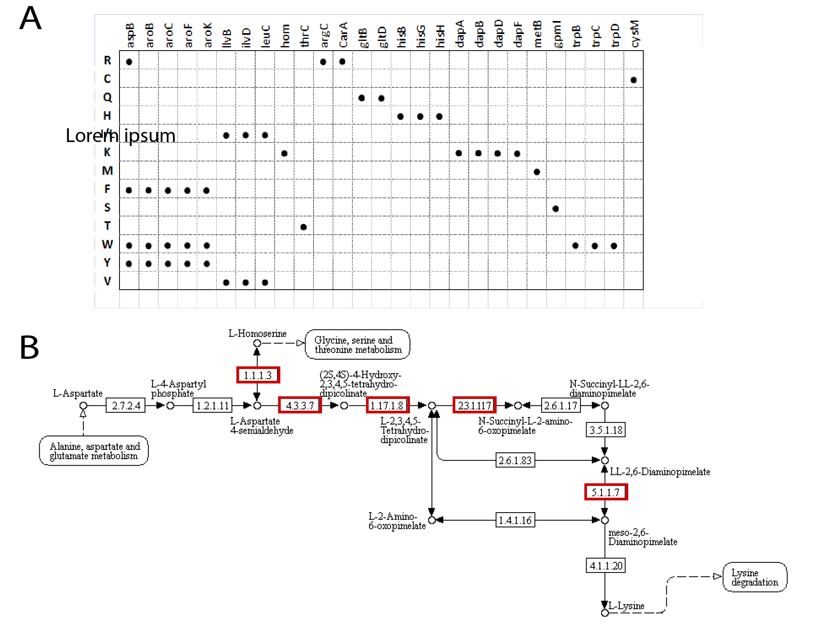
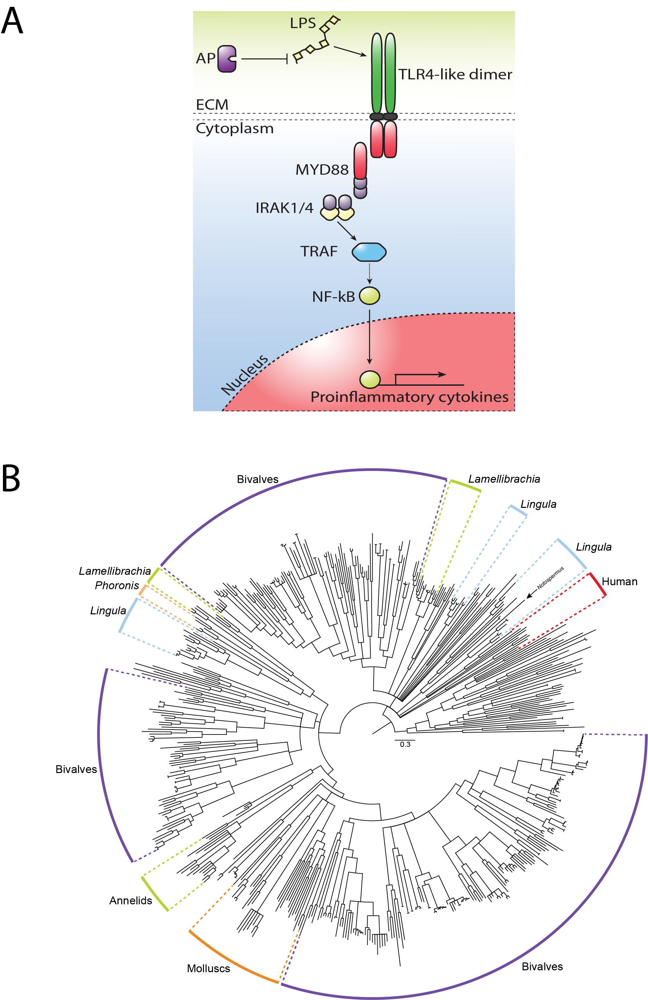

```{r setup, include=FALSE}
knitr::opts_chunk$set(
	message = FALSE,
	warning = FALSE,
	echo=FALSE,
	dpi=300,
	cache=TRUE
	)
```
# Genomic clues of chemosynthetic symbiosis from deep-sea seep-living *Lamellibrachia*
Yuanning Li^1^,^2^\*, Michael G. Tassia^1^, Damien S. Waits^1^, Viktoria E. Bogantes^1^, Kyle T. David^1^, Kenneth M. Halanych^1^

^1^ Department of Biological Sciences & Molette Biology Laboratory for Environmental and Climate Change Studies, Auburn University

^2^ Department of Ecology and Evolutionary Biology, Yale University

\* Corresponding author, yuanning.li@yale.edu


## Abstract
Since the discovery of chemosynthetic symbiosis in hydrothermal vents and cold seeps, the genetic mechanism(s) of how organisms maintain the unique host-symbiont associations at the molecular level is still mostly unknown. The gutless tubeworm *Lamellibrachia* represents one of the longest-lived invertebrates and is widespread in many deep-sea cold seeps, providing an excellent model to study mechanisms like the association of chemosynthetic symbiosis, adaptation to extreme environments. However, the genomic and molecular evolutionary information of tubeworms is exceptionally scarce. Here, we present and characterize the genome of *Lamellibrachia* *luymesi*. We found genomic evidence that symbionts may compensate for the host's deficiency in amino acid biosynthesis. Unexpectedly, we found a large expansion of hemoglobin B1 genes - many of which also possess a free cysteine residue which is hypothesized to function in sulfide-binding. Moreover, we found no evidence that sulfide-binding mediated by zinc ions is conserved across tubeworms, suggesting the hemoglobin structure and the sulfide-binding mechanism is potentially more complex than previously thought. Our comparative analyses suggest the Toll-like receptor pathway may be essential to host immunity and tolerance/sensitivity to symbionts and pathogens. Last, we identified and compiled several genes potentially play an important role in longevity. Thus, these results help elucidate previously unknown links and potential mechanisms related to the evolution of holobionts, adaptations to chemosynthetic environments, and likely extend to other chemosynthetic holobionts.

## Introduction


**Figure 1.** *Lamellibrachia* from seep localities in the Gulf of Mexico.

Since their discovery in the 1980s, siboglinid tubeworms at hydrothermal vents and cold seeps have fascinated evolutionary biologists with their unique symbioses between the worms and chemosynthetic endosymbionts. However, the genetic underpinnings of how organisms maintain the host-symbiont associations at the cellular level are still mostly unknown. The vestimentiferan tubeworm *Lamellibrachia* *luymesi* is distributed along the Gulf of Mexico and is one of the most dominant taxa living in deep-sea cold seeps. At some seeps the vestimentiferan tubeworms are so abundant that they form a unique habitat that is attractive for other species (Fig 1), maintaining alpha and beta biodiversity and facilitating adaptive radiations and evolutionary novelties. Siboglinids typically lack a digestive tract and rely on sulfide-oxidizing bacterial symbionts for nutrition. Hosts acquire their symbionts from the surrounding environment and store them in a specialized tissue called the trophosome [@nussbaumer2006horizontal]. Previous studies suggested that vestimentiferan chemoautotrophic symbionts can use both reverse TCA cycle (rTCA) and the Calvin cycle for carbon fixation as a nutrient source for the hosts [@markert2007physiological, @li2018endosymbiont]. However, previous metabolic and physiological studies primarily focus on symbionts associated with tubeworm host lineages, and studies on how exchanges of nutritions and metabolites between two partners from the host's perspective are still lacking.

One of the key adaptations contributing to the remarkable ability of tubeworms to thrive in chemosynthetic habitats is the ability for siboglinid hemoglobins (Hbs) to bind oxygen and sulfide simultaneously and reversibly at two different sites [@zal1996multi]. To avoid the toxicity of sulfide while transferring it to their chemoautotrophic symbionts, siboglinids possess a multi hemoglobin system with three different extracellular hemoglobins (Hbs; V1, V2, and C1): two dissolved in the vascular blood, V1 and V2, and one in the coelomic fluid, C1 [@arp1981blood, @zal1996multi]. Siboglinid Hbs consist of four heme-containing chains (A1, A2, B1, B2).  Sulfur-binding capabilities are hypothesized to be due to free cysteine residues at key positions in Hbs, especially in the A2 and B2 chains [@zal1997primary]. V1 Hb can form persulfide groups on its four linker chains (L1-L4), a mechanism that can account for the higher sulfide-binding potential of this Hb [@zal1997primary]. However, another study found no evidence of the free cysteine hypothesis and suggested sulfide-binding affinity was mediated by the zinc moieties bound to amino acid residues at the interface between pairs of A2 chains in *Riftia* [@flores2005sulfide]. Thus, it is still not clear which mechanism is primarily responsible for sulfide-binding in siboglinids.

In contrast to the rapidly growing vent-living vestimentiferans [@lutz1994rapid], seep-living vestimentiferans are thought to be the most long-lived non-colonial marine invertebrates (up to 250 year to grow up to two meters) [@bergquist2000longevity]. Immunity is a critical evolutionary driver of maintaining symbiosis [@chu2013innate], has important implications in aging [@quesada2018giant], and is also potentially important for organisms being held in high densities in chemosynthetic environments. However, very little is known about genetic mechanisms related to immunity in most chemosynthetic host species, and it is far more complex in some groups of invertebrates than traditionally recognized from recent studies [@halanych2014repurposed] [@tassia2017toll]. Thus, *Lamellibrachia* provides an excellent model to study immunity function associated with host-symbiont relationships and adaptations to chemosynthetic habitats. However, the genomic and molecular evolution information on extremophile immunity and/or immune tolerance is exceptionally scarce.

Considerable debate persists concerning the evolutionary origins of siboglinids, owing to conflicting theories of its origins from fossil and molecular age estimates. Siboglinids have been claimed to be as old as 430 MYA based on fossil tubes found in the Silurian fossil vent communities [@little2002fossil], but molecular clock analyses suggest a more recent (50-126 MYA) origin based on mitochondrial *COI* or *16S* gene sequences [@little2003hydrothermal]. Recently, Late Cretaceous *Osedax* fossil traces on reptile falls provided a solid calibration point for the molecular clock of the siboglinids (~100 MYA) [@danise2015bone]. Moreover, a detailed chemical and morphological analyses of tubes from the Figueroa deposits suggested they were made by vestimentiferans, which significantly extends the age of this lineage to a Mesozoic origin than previous molecular clock analyses [@georgieva2017identification].

Here, we describe and investigate the genomic, transcriptomic and proteomic sequencing and comparative genomic analysis of tubeworm *Lamellibrachia* *luymesi* collected from the Gulf of Mexico. Our comparative genomic analyses of *Lamellibrachia* provide genomic evidence for genetic pathway and novel candidate genes which may underlie the extraordinary characteristics of tubeworms, including nutrition mode, hemoglobin evolution, immunity function and longevity. Moreover, we also conducted a detailed molecular clock analysis to discern among the hypotheses posed by previous debates concerning the evolutionary origins of siboglinids. Our findings provide hitherto previously unknown evidence of genetic machinery related to tubeworm success in deep-sea chemosynthetic communities, such as vents and seeps.

## Methods
Scripts and data for the analyses are available in a git repository at https://github.com/yzl0084/Lamellibrachia-genome.

## NCBI Accession

### Biological materials.
Adult *Lamellibrachia* *luymesi* specimens were collected from seep localities in the Mississippi Canyon at 754 m depth in the Gulf of Mexico (N 28°11.58', W 89°47.94'), using the R/V Seward Johnson and Johnson Sea Link in October 2009. All samples were frozen at 80˚C following collection.

### Genome sequencing and assembly.
Vestimentum tissue was dissected from one individual, and high molecular weight genomic DNA was extracted using the DNeasy Blood & Tissue Kit (Qiagen) according to the manufacturer’s protocols. Sequencing of six paired-end or mate-pair genomic DNA libraries with insert sizes ranging from 180 bp to 7 kb were performed by The Genomic Services Lab at the Hudson Alpha Institute in Huntsville, Alabama on an Illumina HiSeq 2000 platform (see details in Table S1). Paired-end libraries (180 bp, 400 bp, 750 bp) were prepared using the 125 bp TrueSeq protocols, and mate-pair libraries (3-5 kbp, 5-7 kbp) were generated using the Illumina Nextera Mate Pair Library Kit followed by size selection. Moreover, a 10X sequencing library was constructed using the 10X Chromium protocol (10X genomics) at the Hudson Alpha Institute. The finished library was sequenced on an Illumina HiSeqX platform, using paired 151 bp reads with a single 8 bp index read.

Our genome assembly workflow is shown in Fig. S1. The paired-end and 10X raw reads were checked using FastQC v0.11.5 [@andrews2010fastqc] and quality filtered (Q score >30) using Trimmomatic v0.36 [@bolger2014trimmomatic]. The estimation of genome size, level of heterozygosity, and repeat contents of the *Lamellibrachia* genome was determined by analyzing the kmer histograms generated from the paired-end libraries using Jellyfish v2.2.3 [@marccais2011fast] and GenomeScope [@vurture2017genomescope] (Fig. S2). The mate-pair reads were trimmed and sorted using NxTrim v0.3.1 [@o2015nxtrim] which can recognize and trim the artificial Nextera mate-pair circulation adapters. Only reads from category "mp" (true mate-pair reads) and "unknown" (mostly large insert size reads) were used for downstream scaffolding analysis. Reads from "pe" (paired-end reads) and "se" (single ends) categories were discarded.

Given the high heterozygosity of the *Lamellibrachia* genome, all reads were assembled using Platanus v1.2.4 [@kajitani2014efficient] with a kmer size of 32. Scaffolding was conducted by mapping Illumina paired-end and mate-pair reads to contigs generated by Platanus using SSPACE v3.0 [@boetzer2014sspace]. Gaps in the scaffolds were then filled with GapCloser v1.12 [@luo2012soapdenovo2]. Redundant allele scaffolds were further removed using Redundans v0.13c with default settings [@pryszcz2016redundans]. Genome assembly quality was assessed using QUAST v3.1 [@gurevich2013quast]. Completeness of obtained genome was assessed using BUSCO v3[@waterhouse2017busco] with Metazoa_odb9 database (978 Busco genes).

We also used

### Transcriptome assembly and analysis
Total RNA was extracted from the the plume, vestimentum and trophosome tissue from the same individual of *Lamellibrachia* using Trizol. RNA-Seq of adult tissues from plume, vestimentum, and trophosome was performed using Illumina HiSeq 2000 platform at Hudson Alpha as described above. After quality checking and trimming of raw sequencing reads, transcripts were assembled de novo with Trinity. Transcript isoforms with high similarity (≥ 95%) were removed with CD-HIT-EST v4.7 [@li2006cd]. Transcript abundance was estimated with Bowtie v2.2.9 [@langmead2012fast] and RSEM v1.2.26 [@li2011rsem] by mapping reads back to the transcriptomic assembly based on transcripts per million (TPM). A tissue-specifically expressed gene was defined as a gene that had over 75% of the total transcripts in a particular tissue based on TPM [@albertin2015octopus]. GO enrichment analysis was performed based on the GO annotation using PANNZER2 [@toronen2018pannzer2]. Statistically overrepresented GO terms of trophosome-specific genes were identified using *Lamellibrachia* gene models as background with AgriGO [@du2010agrigo].  

### Proteomics characterization.
Proteomic analyses of *Lamellibrachia* trophosome tissue were performed by Proteomics & Metabolomics Facility at Colorado State University. Briefly, samples were transferred to 5mL tubes appropriate for use in the Bullet Blender Storm 5 (Next Advanced). Freshly cleaned, 3.2mm stainless steel beads were added at an approximate 1:1 sample: bead volume ratio (1-5 beads). The tissue/bead mixture was then combined with 1X PBS (Hyclone) spiked with 1X Halt Protease Inhibitor cocktail (Thermo Scientific) for an approximate 2:1 liquid: solid ratio (150-600μl). Tissue homogenization was achieved using speed setting 12 for 5 minutes. The stainless steel beads were removed and 0.1mm glass beads added at approximately 1:1 sample:bead ratio. Further homogenization was achieved at speed 8 for 3 minutes. Homogenate was then transferred to 1.5mL microcentrifuge tubes and subjected to cup horn sonication (Amplitude 70, 10s pulse, 20s off, 7 minutes total exposure time; Qsonica) while suspended in ice water. Insoluble material was pelleted by brief centrifugation at 3000xg. The resulting supernatant was subjected to protein quantification by the Pierce BCA Protein Assay Kit (ThermoFisher-Pierce) following manufacturer’s instructions. Absorbance of reacted samples was measured at 550nm and protein quantification stemmed from a quadratic fit of the Bovine Serum Albumin (BSA) standard curve.

50 μg total protein was aliquoted from each sample and processed for in-solution trypsin digestion as previously described (Schauer et al. 2013). A total of 0.5μg of peptides were then purified and concentrated using an on-line enrichment column (Waters Symmetry Trap C18 100Å, 5μm, 180 μm ID x 20mm column). Subsequent chromatographic separation was performed on a reverse phase nanospray column (Waters, Peptide BEH C18; 1.7μm, 75 μm ID x 150mm column, 45°C) using a 90 minute gradient: 5%-30% buffer B over 85 minutes followed by 30%-45%B over 5 minutes (0.1% formic acid in ACN) at a flow rate of 350 nanoliters/min. Peptides were eluted directly into the mass spectrometer (Orbitrap Velos Pro, Thermo Scientific) equipped with a Nanospray Flex ion source (Thermo Scientific) and spectra were collected over a m/z range of 400–2000 under positive mode ionization. Ions with charge state +2 or +3 were accepted for MS/MS using a dynamic exclusion limit of 2 MS/MS spectra of a given m/z value for 30 s (exclusion duration of 90 s). The instrument was operated in FT mode for MS detection (resolution of 60,000) and ion trap mode for MS/MS detection with a normalized collision energy set to 35%. Compound lists of the resulting spectra were generated using Xcalibur 3.0 software (Thermo Scientific) with a S/N threshold of 1.5 and 1 scan/group.

Tandem mass spectra were extracted, charge state deconvoluted and deisotoped by ProteoWizard MsConvert (version 3.0). Spectra from all samples were searched using Mascot (Matrix Science, London, UK; version 2.6.0) against gene models of *Lamellibrachia* host and symbiont genomes (derived from [@li2018endosymbiont]) assuming the digestion enzyme trypsin. Mascot was searched with a fragment ion mass tolerance of 0.80 Da and a parent ion tolerance of 20 PPM. Oxidation of methionine and carbamidomethyl of cysteine were specified in Mascot as variable modifications. Search results from all samples were imported and combined using the probabilistic protein identification algorithms [@keller2002empirical] implemented in the Scaffold software (version Scaffold_4.8.4, Proteome Software Inc., Portland, OR) [@searle2008improving]. Protein identifications were accepted if they could be established at greater than 99.0% probability and contained at least 1 identified peptide. Protein probabilities were assigned by the Protein Prophet algorithm [@nesvizhskii2003statistical]. Proteins that contained similar peptides and could not be differentiated based on MS/MS analysis alone were grouped to satisfy the principles of parsimony.

### Genome annotation.
Our genome annotation workflow is shown in Fig. S3. Gene models of the *Lamellibrachia* genome were constructed following the Funannotate pipeline 1.3.0 (https://github.com/nextgenusfs/funannotate). Briefly, repetitive regions in the *Lamellibrachia* genome assembly were identified using RepeatModeler v1.0.8 [@smit2008repeatmodeler] and were subsequently soft-masked using RepeatMasker v4.0.6 [@chen2004using]. RNA-Seq data from different tissue were leveraged to improve the accuracy of gene prediction. RNA-Seq data were assembled *de* *novo* into a single transcriptome using Trinity v2.4.0 [@haas2013novo] and HISAT 2.1.0 [@kim2015hisat] was used to align  RNA-Seq reads to the *Lamellibrachia* genome assembly. the transcriptome assembly was then passed to the PASA pipeline v2.3.3 [@haas2003improving] to identify high-quality gene models. The aligned RNA-Seq data was used to train the *ab* *initio* gene predictor using AUGUSTUS v3.3 [@stanke2006augustus]. Protein alignments from the SwissProt database to *Lamellibrachia* assembly was generated using exonerate [@slater2005automated] and Trinity/PASA transcripts were aligned to the genome using Minimap2 v2.1 [@li2018minimap2]. The tRNA genes were identified using tRNAscan-SE v1.3.1 [@lowe1997trnascan]. Finally, EvidenceModeler 1.1.0 [@haas2008automated] was used to combine all the evidence of gene prediction from protein alignments, transcript alignments, and *ab* *initio* predictions to construct high-quality consensus gene models. Functional annotations of predicted gene models was performed using several curated databases: KEGG orthology was assigned using the KEGG Automatic Annotation server [@moriya2007kaas]. Gene models were further annotated with domain structure and protein identity by InterProScan [@zdobnov2001interproscan] and SwissProt database, respectively. Secreted proteins were predicted using SignalP [@petersen2011signalp] and Phobius [@kall2007advantages] using InterProScan.

### Gene family analysis
Following all-to-all Diamond v1.0 [@buchfink2014fast] BLASTP searches against 22 selected lophotrochozoan proteomes (Table S2), orthology groups (OGs) were identified using Orthofinder with a default inflation parameter (I=1.5). Gene ontology annotation was performed using PANTHER v13.1 [@mi2016panther] with the PANTHER HMM scoring tool (pantherScore2.pl). Gene family expansion and contraction was estimated using CAFÉ v2.1 [@de2006cafe]. For each gene family, CAFÉ generated a family-wide P value, with a significant *P* value indicating a possible gene-family expansion or contraction event as suggested in the manual. Significantly expanded gene families (*p* < 0.05)were then classified by InterProscan.

In addition to the above gene family expansion or contraction analysis, the protein-coding sequences were used for discovery of genes under positive selection in from *L*. *luymesi* in comparison with selected lophotrochozoan species (including *Capitella* *teleta*, *Lottia*  *gigantea*, *Helobdella* *robusta*, *Octopus*  *bimaculoides*, *Crassostrea*  *virginica*, *Notospermus* *geniculatus* and *Phoronis* *australis*) using PosiGene, which is an automated pipeline for genome-wide detection of positively selected genes , with default settings (p < 0.05). In this positive selection analysis through the PosiGene pipeline, *L*. *luymesi* was used as the reference and anchored species for ortholog assignment of each OG.

### Manual annotation of gene families with potential interest.
In addition to the automatic annotation process mentioned above, we manually annotated genes that are general interest, such as hemoglobin gene families, genes related to amino acid synthesize, immunity function or longevity. These genes were specifically selected *a* *priori* based on our experience after a revision of the available publications in the field. For hemoglobin genes, datasets used for Hb gene family analyses, identified homologs, and their respective accession numbers are available in Fig. S# .Hbs and linker sequences of interest were obtained from *Lamellibrachia* genome and assembled siboglinid transcriptomes (see molecular clock analysis below) via diamond blastp (evalue cutoff 1E-5) by utilizing Hb and linker sequences acquired from GenBank of siboglinids as databases (Figure #). Sequences with best hits to target proteins were annotated for protein domain architecture using the Pfam databases included in InterProscan. After manual removal of redundant and incorrect sequences (e.g., sequences are too short or lack of globin domain), we used MAFFT 7.2.15 [@katoh2013mafft] to align Hb amino acid sequences. Maximum likelihood analyses were performed in IQTree under the best-fitting models for associated partition schemes determined by Modelfinder implemented in IQTree with ultrafast bootstrapping of 1000 replicates.

Our analysis for immunity-related genes largely follows the same workflow as used for Hbs, but instead were processed through the Extract_Homologs2 script used in [@tassia2017toll] (available at https://github.com/mtassia/Homolog_identification). Target proteins are available in Table S#. Importantly, the Extract_Homologs2 script identifies unique protein sequences within an animo acid dataset which fall within user-defined domain architecture criteria (Table S#+1). Due to this stringency, the pipeline identifies the complement of unique proteins for any target family, not the number of synonymous genes encoded in a genome.  Full amino acid sequences for TLRs were placed in a phylogenetic context using the bioinformatic workflow delineated above for Hbs.

Genes related to amino acids synthesis from *Lamellibrachia*, *Lamellibrachia* symbionts, and *Capitella* *teleta* genomes were performed by using the KEGG2 KAAS genome annotation web server and then visualized by the KEGG Mapper Reconstruct Pathway too. A BLASTp search of protein sequences from the genome annotation were queried against the Swiss-Prot database was used to search and supplement for proteins that were missing in the visualized KEGG pathway (Table S#).

### Phylogenomics and Molecular clock analysis
Analysis of siboglinid phylogeny was conducted utilizing from publically available transcriptomic datasets (n=16) in conjunction with our newly generated*Lamellibrachia* proteome (Table S3). Sequence assembly, annotation, homology evaluation, gene tree construction, parsing of genes trees to OGs, and supermatrix construction were conducted with Agalma [@dunn2013agalma]. The final analyses presented here contained 13 siboglinids and four outgroups based on current understanding of annelid phylogeny. Maximum likelihood phylogenetic reconstructions were performed in IQTree under the best-fitting models for associated partition schemes determined by Modelfinder implemented in IQTree 1.6.3 [@nguyen2014iq] with ultrafast bootstrapping of 1000 replicates (Fig. S#).  

For the molecular clock analysis, a relaxed molecular clock with a lognormal distribution and a Yule tree model was used in BEAST 2 v2.5.1 [@bouckaert2014beast]. A calibration was placed on the node representing the most recent common ancestor (MRCA) of four *Osedax* species using a normal distribution with a mean of 100 MYA and a standard deviation of 10 following the findings of [@danise2015bone]. Another calibration was placed on the node of MRCA of Serpulida and Sabellida using a normal distribution with a mean of 267 MYA [@sanfilippo2017first]. Molecular clock analyses with BEAST 2 consisted of two independent runs with 1 million MCMC generations sampled every 1000 generations. Convergence was checked and confirmed by comparing trace plots in Tracer ensuring the effective sample size of each parameter was greater than 100 and that stationarity appeared to have been achieved. Log and tree files were combined using Logcombiner. A maximum clade credibility tree with mean heights was calculated using TreeAnnotater. The resulting time-calibrated tree was plotted using R packages, including phyloch, strap, and OutbreakTools. Bayesian inference using a molecular clock resulted in identical branching patterns as analysis with IQTree.

## Results and Discussion

### Genome features
The genome of *Lamellibrachia* was sequenced using a combination of Illumina paired-end, mate-pair, and 10x techniques. Results from high-throughput sequencing and genome assembly for *Lamellibrachia* are presented in Table S3 with at least 300 fold coverage using a combination of Illumina paired-end, mate-pair and 10X genomic sequencing with a variety of insert sizes. The haploid genome assembly size is ~687 Mb, similar to the result of  genome size estimation using GenomeScope (~646 Mb) (Fig. S2). The N50 value of the assembled scaffolds and contigs is 373 Kb and 24 Kb, respectively. Although N50 lengths and assembly quality of *Lamellibrachia* are comparable to those of other annelids (e.g. *Capitella* *teleta*, *Helobdella* *robusta*) (Table S4), the overall genome completeness measured by BUSCO (~ 95%) is one of the highest among other lophotrochozoans (Table S5), indicating the completeness of the genome assembly. With the support of RNA-seq data from different tissues, we estimated *Lamellibrachia* genome contains 38,998 gene models. The genome also exhibits a similar level of heterozygosity (0.6%) and repetitive contents (36.92%), compared to other lophotrochozoan genomes. The repeat contents of *Lamellibrachia* genome is shown in Table S6. We found 94 OGs appear to have undergone a genomic expansion compared to other lophotrochozoan genomes (Table S8).

### Nutritional adaptations to a symbiotic life stage


**Figure 2.** *Lamellibrachia* lacks many genes related to amino acid biosynthesis. (A) Genes present in *Lamellibrachia* symbiont and *Capitella* *teleta* genomes but absent in *Lamellibrachia* genome. (B) Example of Lysine biosynthesis pathway in *Lamellibrachia*. Red boxes represent missing genes in the pathway.

Adult *Lamellibrachia* worms lack a digestive tract and rely solely on endosymbionts for nutrition. Noticeably, only 57 genes associated with amino acid biosynthesis were found in the *Lamellibrachia* host genome, of which eight were identified as proteins (Supplementary Data 1), whereas 90 genes were identified in *Capitella* genome (Fig. 2A). In contrast, the genome of the *Lamellibrachia* symbiont (110 genes) contains an essentially complete gene sets for the biosynthesis of all 20 proteinogenic amino acids and of 11 vitamins/cofactors. The lack of 30 genes related amino acid synthesis in *Lamellibrachia* compared to *Capitella* genome are involved in the biosynthesis of 13 out of 20 amino acids (e.g. five key enzymes in the Lysine biosynthesis pathway Fig. 2B).  As amino acids are indispensable for protein biosynthesis in the host, the sparse presence of amino acid synthesis-related genes in *Lamellibrachia* genome may indicate that the host depends on its symbionts for supply with amino acids and cofactors. Moreover, we found a large gene expansion of nutrient uptake ABC transport protein-coding genes in *Lamellibrachia* compared with other lophotrochozoans (Table S7). These findings are consistent with previous biochemical analyses which suggest that *Riftia* is also dependent on its bacterial symbiont for the biosynthesis of polyamines that are important for host metabolism and physiology [@minic2003arginine]. Interestingly, a similar mechanism of overcoming host-deficiency in amino acid synthesis has also been suggested in thiotrophic vesicomyid symbioses of *Calyptogena* *magnifia* [@newton2008comparative] and vent mussel symbioses of *Bathymodiolus* *azoricus* [@ponnudurai2017metabolic]. These results emphasize the potential that host-deficiency in amino acid syntheses and exchanges of metabolites between two partners might to be a common strategy for chemosynthetic symbioses.

In addition to the immediate release of fixed carbon and provision of  amino acids by the symbionts, we have found proteomic evidence of a second possible nutritional mode - digestion of symbionts directly by the host, as showed by the detection of abundant host-derived digestive enzymes in the trophosome tissue (Table S9). Although previous observations indicated that symbiont could be digested by *Riftia* [@bright2000autoradiographic], the direct evidence and underlying genetic mechanisms related to symbiont digestion were not characterized. We identified fifteen the host proteins related to lysosomal proteases that were both highly expressed and detected as proteins in the trophosome tissue, such as *Saposin* and multi copies of *Cathepsin* (Table S9). Lysosomes contain an array of digestive enzymes used for protein degradation in eukaryotic cells and are thought to play an essential role in symbiont digestion of *Bathymodilus*. *azoricus* [@ponnudurai2017metabolic]. We additionally identified 19 major proteasome components as proteins in the trophosome tissue, indicating a potential role in protein degradation of symbiont digestion. Thus, our results suggest that lysosomal host proteases and proteasome may facilitate the degradation of symbiont proteins during symbiont digestion, and may play a role maintaining population load of symbionts within trophosome, or possibly both.

Because the trophosome tissue of *Lamellibrachia* contains sulfur-oxidizing symbionts, we also characterized ~ 200 bacterial proteins present in the trophosome tissue to gain insights into the symbiotic relationship between the bacteria and their host. Key enzymatic genes, RubisCO, and ATP citrate lyase (ACL) type II associated with these carbon fixation cycles, were identified as proteins in *Lamellibrachia* symbionts (Table S9). Our results further corroborate the idea that the presence of rTCA in addition to CBB pathways for carbon fixation might be common in all vent-dwelling and seep-living vestimentiferan endosymbionts. We also identified several key components related to sulfide and nitrogen metabolic pathways, and the results are largely consistent with previous analyses [@markert2007physiological, @li2018endosymbiont].

### Hemoglobin evolution


**Figure 3.** Hemoglobin gene family evolution in *Lamellibrachia* genome. (A) Partial alignment of sampled siboglinid Hb subunit A1, A2, B1, B2 sequences. Only positions contain free cysteines or cysteine residues are involved in disulfide bridge were shown in the alignment. (B) Gene tree of siboglinid Hb subunit A1, A2, B1 and B2. Only *Lamellibrachia* Hb sequences (from NCBI or this study) were labeled at the tips. (C) *Lamellibrachia* Hb sequences identified that are highly expressed in the trophosome tissue or as proteins from proteomic data.

Partial alignment and gene tree of siboglinid Hbs are shown in Figure 3A, 3B. The expression of Hb subunit A1, A2, B1, B2, and linker L1-L4 were among the highest in the trophosome compared to the plume and vestimentum, and we were able to identify most of them in the mass spectrometry (Fig. 3C). Consistent with previous studies [@zal1996multi], a single copy of A2 and B2 Hb was identified in all siboglinids to possess conserved-free cysteines (i.e., cysteine residues not involved in disulfide bridges) at position 77 and 67, respectively. With exception of A2 and B2 Hb globins in *Lumbricus* *terrestris*, homologous cysteine residues were identified in *Cirratulus* *spectabilis*, *Sabella* *pacifica*, and *Sternapsis* sp. from sulfide-free environments and *Arenicola* *marina* living in sulfide-rich environments (Fig. 3A). These results support the hypothesis that free cysteine residues in A2 and B2 globins were present and conserved prior to the radiation of the Siboglinidae and potentially involved in H2S detoxification process [@bailly2002evolution].

Surprisingly, we found a significant expansion of B1 globins in *Lamellibrachia* genome which possesses 25 copies (Fig. 3B). *Riftia* may also contain a comparable B1 globin expansion since three B1 globins were identified using a set of degenerate PCR primers in the previous study [@bailly2002evolution]. Noticeably, we found that eight copies of *Lamellibrachia* B1 sequences also contains a free cysteine at position 77, same position as free cysteine in A2 globins. Five out the eight copies were highly expressed in the trophosome, and one copy was identified at the protein level. Unlike A2 and B2 globins, it was long thought that B1 globins could only bind O2 and lacks the capacity to bind sulfide. Although the presence of free cysteine residues is not proof of sulfide binding also occurs in B1 globins, it is at least possible that the hemoglobin structure and sulfide binding function is more complex than previously thought due to unexpected a large B1 expansion and high expression of *Lamellibrachia* B1 sequences (Fig. 3C).

Instead of free cysteines, another hypothesis suggested that the H2S binding affinity has been mediated by the zinc moieties bound to amino acid residues at the interface between pairs of A2 chains in *Riftia* [@flores2005sulfide]. Figure S4 shows an alignment of amino acid sequences of A2 globins from Siboglinidae and other annelids. Amino acids involved in the binding to of zinc ions in *Riftia* A2 globin pairs are highlighted (Fig. S4). Each A2 chain posesses one complete Zn2+-binding site and shares two others with adjoining A2 subunits [@flores2005sulfide]. The Zn2+-binding site contained within A2 chain is composed of three His residues (B12, B16, and G9) [@flores2005sulfide]. However, none of these sites are conserved across siboglinids, or even in vestimentiferans (Fig. S4). For example, B16 His site is replaced by a variety of amino acids in seep-living vestimentiferans. Thus, it is less likely that the zinc sulfide binding mechanism is a conserved function in siboglinids, and might only be a derived function just for vent-living vestimentiferans.

### Immunity function


Figure 4. Putative Toll-like receptor pathway in *Lamellibrachia* genome. (A) Putative TLR4-like pathway in *Lamellibrachia* might be essential for immunity and response to symbionts and pathogens. (B) Toll-like receptor gene trees from selected lophotrochozoan genomes.

The immune function between hosts and symbionts is a key evolutionary driver that is under strong selective pressure and has potential implications in aging (REFERENCE). However, the genetic machinery and functionality of the immune system in most chemosynthetic symbioses has not been extensively characterized. We found several genes related to immune function are expanded in *Lamellibrachia* compared with other lophotrochozoans (Table S7). Toll-like receptor (TLRs) provides a core cellular and molecular interface between invading pathogens and recognition of host-microbial symbiosis [@chu2013innate] (Fig. 4A). Consistent with previous analyses [@luo2018nemertean], we found that TLR genes were individually expanded in among lophotrochozoan lineages, especially in bivalves  (Fig. 4B). Noticeably, we found several lineage-specific expansion of putative TLR genes in *Lamellibrachia* genome with 33 copies, whereas only five copies were found in *Capitella* genome, suggesting TLR genes in *Lamellibrachia* may play some discernably important role in *Lamellibrachia* independent of their role(s) in *Capitella*. Whereas our phylogenetic reconstruction of TLR relationships resolves major orthology groups among lophotrochozoan TLRs, showing yet another example of lineage-driven expansions among invertebrate clades (Tassia et al. 2017), our taxon sampling does not provide the appropriate phylogenetic distribution to resolve relationships between lophotrochozoan TLRs and vertebrate TLRs. To resolve pan-metazoan TLR orthology groups, deep taxonomic sampling and time/resource-intensive phylogenetic inference protocols will be required.

Based on KEGG mapping, a substantial subset of all *Lamellibrachia* TLR proteins best identify as TLR4 by primary sequence identity (and among all other TLRs in the KEGG GENES database). In mammals, TLR4 recognizes and binds lipopolysaccharide (LPS; a major cell-membrane component of Gram-negative bacteria, including tubeworm symbionts). LPS-bound TLR4 then initiates a signal-transduction pathway that activates NF-kB, a transcription factor that promotes the expression of pro-inflammatory cytokines [@park2013recognition].  Because orthology is uncertain (Fig. 4), the TLRs identified by KEGG will be referred to as TLR4-like. *Lamellibrachia* encodes seven TLR4-like proteins, which is in contrast to *Capitella*’s single TLR4-like protein – lending to the potential for increased sensitivity to Gram-negative bacteria in *Lamellibrachia* [@cavanaugh1981prokaryotic]. Interestingly, we also found genomic expansions of tumor necrosis factor receptors (TNFRs) and TNFR-associated factors (TRAFs) (Table S7). TNFRs and TRAFs play vital roles in activation and the downstream responses of NF-kB, further supporting a specialized role for TLR4-like signaling in *Lamellibrachia*. We additionally investigated components of the innate immunity’s RIG-1-like receptor signaling pathway (which recognizes virus-derived nucleotide present in the cytoplasm) and found no indication of gene expansion.

The initial physical encounter between tubeworms and symbionts occurs in an extracellular mucus secreted by pyriform glands by newly settled larvae [@nussbaumer2006horizontal]. Within these mucus matrices, symbionts can attach to the host using extracellular components secreted from symbionts, such as LPS. The symbiont’s colonization process terminates with massive apoptosis of skin tissue as symbionts travel from host epidermal cells into trophosome [@nussbaumer2006horizontal]. This result is consistent with that recognition of lipopolysaccharide (LPS) by TLR4 can result in the induction of signaling cascades that lead to activation of NF-kb and the production of proinflammatory cytokines [@chu2013innate]. Although it is still not clear how the host distinguishes between symbionts and pathogens in most symbioses, alkaline phosphatase has been shown to be involved in the maintenance of homeostasis of commensal bacteria in the squids, mouse, and zebrafish [@bates2007intestinal]. The commensal bacterially-derived LPS signaling via TLR4 yields an upregulation of intestinal alkaline phosphatase and prevents inflammatory responses to the resident microbiota. Importantly, we also identified eight copies of alkaline phosphatase in *Lamellibrachia*, whereas only one copy was found in Capitella, further supporting a potential mechanism of tolerating Gram-negative bacteria and facilitating symbiotic colonization. Although further analysis is warranted to investigate these hypotheses mechanistically, a TLR4-like signaling pathway may be central for host immunity and in distinguishing between symbionts and pathogens (Fig. 4A).

In addition to TLRs and their cohort of signaling intermediates, we also found evidence of the genomic expansion of NLRP family, which plays a key role in the inflammasome, an innate immunity protein complex that recognizes infectious pathogens and regulates the activation of inflammatory caspases.  We found large expansions of several members of Sushi domain-containing proteins that could be involved recognition and adhesion between hosts and symbionts (REFERENCE).


### Aging and cell cycle
The extreme longevity of seep-living vestimentiferans is expected to involve genes affecting aging. However, genetic mechanisms involved in aging on *Lamellibrachia* are incredibly scarce. Besides genomic expansions of genes related to innate immunity mentioned above, our analysis also highlighted several genes in *Lamellibrachia* that may play a direct role in aging (Table S8). Overcome of oxidative stress is thought to be a hallmark of aging [@liguori2018oxidative]. We found genomic expansions of Mn-superoxide dismutase (Sod2) and CuZn-superoxide dismutase (Sod1) genes in *Lamellibrachia* genome compared to other lophotrochozoans (Fig. S5). Most lophotrochozoan genomes contain one or two copies of Sod1 and Sod2 , whereas we found five copies of each gene (FIg. S5). Importanyly, we are be able to identify four of five Sod2 genes as proteins. The Sods have important function role in cells to protect against oxidative damage induced by metabolism, and Sod2 has drawn particular interest because it is located within mitochondria and appears to be involved in other processes, including tumor suppression and cellular differentiation in mammals [@li1995dilated]. Previous studies suggested that overexpression of Sod1 or Sod2 could significantly extend lifespan in mamamals, fruit flies and *C*. *elegans* (Citations). Interestingly, Sod gene product was thought to help symbionts overcome host cellular immune responses (Bright and Bulgheresi, 2010), and previous study was identified in all vestimentiferan symbiont genomes. We also be able to identify symbionts' Sod gene as proteins in proteomic analysis (Table #). Thus, Sods may play a central role in tubewomr symbiosis for overcoming oxidative damage and essential for extreme longevity for seep-living vestimentiferans. Moverover, a large expansion of interleukin 6 receptors (IL6R) was found in comparative analysis (Table S#). IL6R is the key component of IL-6 pathways which is the main signalling implicated in aging [@maggio2006interleukin].


### Phylogeny and molecular clock of tubeworm

```{r preliminaries}
library(phyloch)
library(strap)
library(OutbreakTools)

t <- read.annotated.nexus("../time_calibrartion/beast.tre")

t$root.time <- t$root.annotation$height

geoscalePhylo(tree=ladderize(t,right=FALSE), units=c("Era", "Period", "Epoch"), boxes="Epoch", cex.tip=0.5, cex.age=0.7, cex.ts=0.7, label.offset=0, x.lim=c(-15,400), lwd=3, width=2)
```
Figure 5. Molecular clock tree of tubeworm origin.

Two additional *Osedax* taxa were added in the study compared to the previous siboglinid phylogenomic analyses [@li2017phylogenomics] (Table S3). The final supermatrix dataset contains 191 genes single-copy orthologs. Bayesian inference with a relaxed molecular clock (Fig. 2) recovered the same topology as ML analysis in IQTree with strong nodal support (Fig. #). Both analyses strongly support *Osedax* is most closely related to the Vestimentifera + *Sclerolinum* clade and Frenulata is the early diverging group, as recently reported [@li2015mitogenomics]. Within Vestimentifera, *Lamellibrachia* is sister to the remaining sampled vestimentiferans. Molecular clock analyses based on phylogenomic dataset suggest modern siboglinid diversity originated in Mesozoic (223 MYA ± 80 MY), conflicting with previous hypotheses indicate a Late Mesozoic or Cenozoic approximately 50-126 MYA. The previous analyses are solely based on the estimation of nucleotide divergence of COI sequences on limited taxa sampling (mainly vestimentiferans). However, mitochondrial genes of vestimentiferans may have experienced a "slowdown" in the rate of nucleotide substitution relative to other siboglinid lineages [@li2015mitogenomics].

Moreover, molecular clock analysis suggests a younger split of vestimentiferans during the Cenozoic (60 MYA). Recent analyses indicated that Jurassic tubes from Figueroa deposits are likely to have been made by vestimentiferans [@georgieva2017identification], but this hypothesis is not supported in our analysis. Thus, we provide the molecular clock of the siboglinid phylogenetic tree, placing a common siboglinid ancestor as far back as the Jurassic. Siboglinid vestimentiferans might exploit and adapt to vents and seeps during Cenozoic (<65 MYA). This adds to the growing evidence that the Cenozoic was a key period for the radiation of nany dominant invertebrate taxa now occupying in deep-sea chemosynthetic communities [@vrijenhoek2013instability].

## Conclusion

## Acknowledgments

## Author contribution


## Supplemental Information
kable(dt) %>%
  kable_styling(bootstrap_options = c("striped", "hover", "condensed"))
